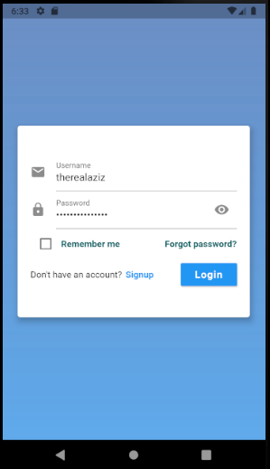

# Scene It

A cross-platform e-commerce mobile app made in flutter to connect home artists and art buyers.
Augmented reality feature that allows real time viewing of art in user’s surroundings, chatting & commenting features, searching & recommendation systems, making posts and browsing store, motivation and audio meditation playing features etc.

This is a university project created by three Computer Science students in Islamabad, Pakistan. 

## Screenshots

 

 

